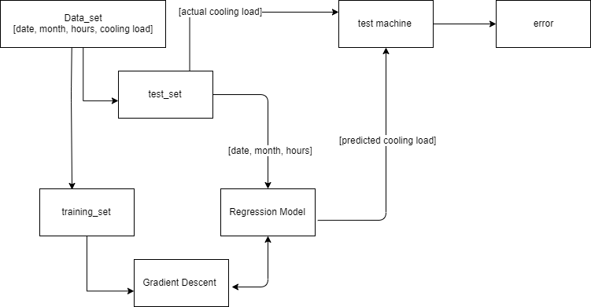

# LUN7 FYP2019 PROGRESS
## 10-06-2019
`Progress`
- developed a cooling load predictive model
- a 10 degree polynomial regression model
- 10 degree has the best fit (while>10 overfit, while>10 underfit)
- r2 value = 0.668

`Problem`
- model can only be examinated by exiting data

`Solution`
#### More ambigous goal
- design a mini real model
- a cooling device 
- tempeature sensor
- humidity sensor
- controling unit (raspberry pi)
- log data 
- learn the model charateristic 
- optimise the control algorithum with built model 
